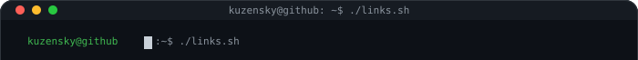
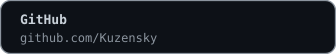
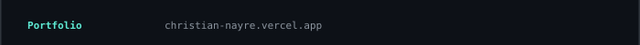
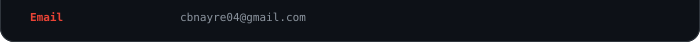

<!-- ============ HEADER ============ -->

  <picture>
    <source media="(prefers-color-scheme: light)" srcset="https://www.gitskins.com/api/section/wordmark?username=Kuzensky&theme=github-dark&mode=light" />
    
  </picture>

<!-- ============ TAGLINE ============ -->

  

---

<!-- ============ WHOAMI ============ -->

  

    
🎨 teal

     
    
  

  

    
🎨 amber

     
    
  

---

<!-- ============ TECH STACK ============ -->

  

---

<!-- ============ CONNECT ============ -->

  

  
  
   
  
  

---

<!-- ============ GITHUB ACTIVITY ============ -->

  

  no cap, this profile has better uptime than my sleep schedule

