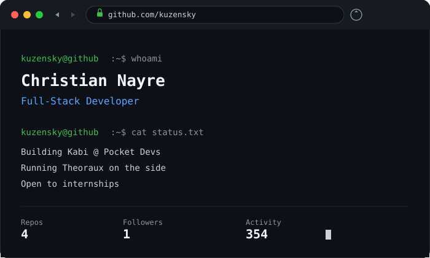

<!-- ============ HEADER ============ -->

  <picture>
    <source media="(prefers-color-scheme: light)" srcset="https://www.gitskins.com/api/section/wordmark?username=Kuzensky&theme=github-dark&mode=light" />
    
  </picture>

<!-- ============ TAGLINE ============ -->

  

---

<!-- ============ HEATMAP ============ -->

  

---

<!-- ============ WHOAMI ============ -->

  

---

<!-- ============ TECH STACK ============ -->

  
  
  
  
  
  
  
  

---

<!-- ============ STATS ============ -->

  
  

---

<!-- ============ FOOTER ============ -->

  
  
  

  no cap, this profile has better uptime than my sleep schedule

