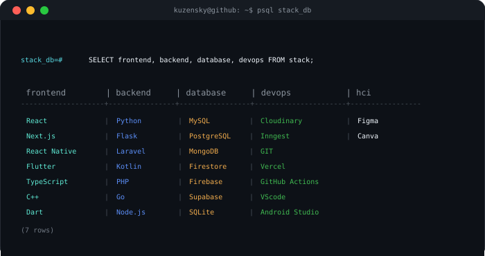
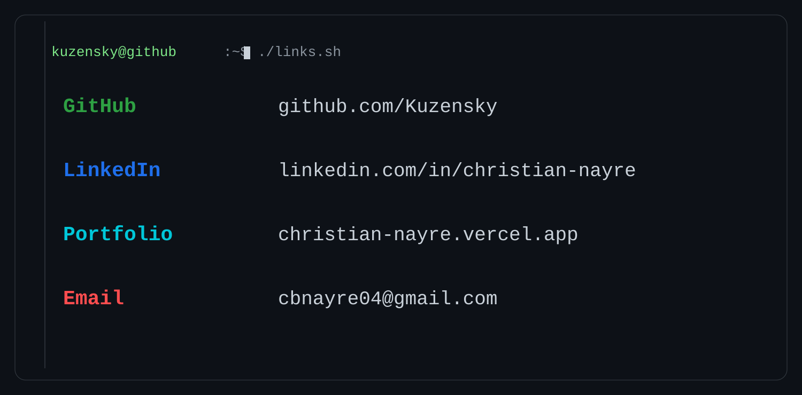

<!-- ============ HEADER ============ -->

  <picture>
    <source media="(prefers-color-scheme: light)" srcset="https://www.gitskins.com/api/section/wordmark?username=Kuzensky&theme=github-dark&mode=light" />
    
  </picture>

<!-- ============ TAGLINE + WHOAMI ============ -->
<table align="center" width="100%">
  <tr>
    <td width="50%" align="center" valign="top">
      
    </td>
    <td width="50%" align="center" valign="top">
      
    </td>
  </tr>
</table>

---

<!-- ============ TECH STACK ============ -->

  

---

<!-- ============ CONNECT ============ -->

  

---

<!-- ============ GITHUB ACTIVITY ============ -->

  

  no cap, this profile has better uptime than my sleep schedule

